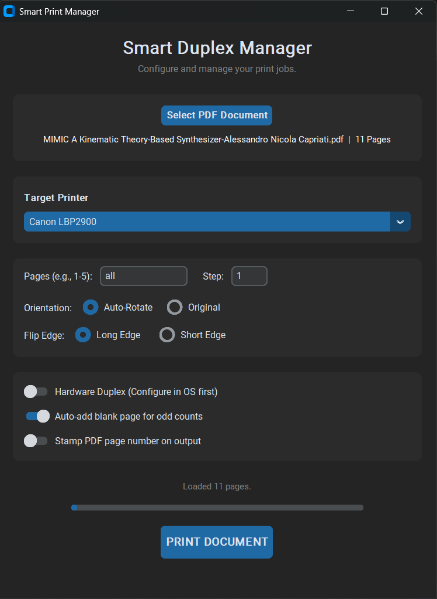

# Smart Print Manager

A modern, standalone desktop utility for advanced manual duplexing and intelligent PDF print management on Windows.

## Overview

Standard operating system print dialogs often fall short when dealing with home or office printers that lack automatic double-sided (duplex) capabilities. Attempting to manually print odd and even pages for large documents frequently results in misaligned pages, incorrect orientations, and wasted ink.

Smart Print Manager bridges this gap. It provides a dedicated, intelligent engine that handles the complex logic of manual duplexing, page rotation, and selective printing, all wrapped in a clean, modern user interface.

<p align="center">
  
</p>

## Core Features

- **Intelligent Manual Duplexing:** Automatically splits print jobs into sequential odd and even passes. It intelligently pauses your print queue, prompts you to flip the physical paper stack, and automatically pads odd-numbered print jobs with a blank page to ensure the final sheet aligns perfectly.
- **Advanced Range & Step Sizing:** Granular control over your print jobs. Input complex page ranges (e.g., "1-15, 18, 20-22") and apply specific step sizes to print exactly what you need.
- **Auto-Orientation Engine:** Dynamically analyzes the aspect ratio of each individual PDF page against the physical paper feed dimensions of your selected printer.
- **Dynamic Page Stamping:** Optionally draws the native PDF page number onto the bottom right corner of the physical output.
- **Hardware Duplex Passthrough:** Seamlessly hands off jobs to printers with built-in duplexing.
- **Modern Interface:** Built with CustomTkinter for a sleek design.

## Prerequisites

- Windows Operating System
- Python 3.8 or higher
- A valid local or network printer

## Installation for Developers

1. Clone the repository:

    ```bash
    git clone https://github.com/C00LVansh/smart-print-manager.git
    cd smart-print-manager
    ```

2. Install dependencies:

    ```bash
    pip install customtkinter PyMuPDF Pillow pywin32
    ```
    
3. Run the application:

    ```bash
    python smart_print.py
    ```
    
## Compiling to an Executable

1. Install PyInstaller:

    ```bash
   pip install pyinstaller
    ```

3. Build the executable:

    ```bash
    pyinstaller --noconsole --onefile smart_print.py
    ```

4. The executable will be inside the `dist` folder.

## License

This project is licensed under the MIT License.
